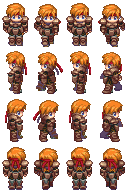

## 프로젝트명
The World  
(팀 프로젝트 : 코딩 부분 전적으로 담당)
## 사용언어
JAVA
## 개발기간
2016.08~2016.11
## 프로젝트 소개
JAVA 언어를 이용한 RPG 게임
스윙 컴포넌트를 이용해 GUI 구현
*****
## 실행화면
이미지를 클릭하면 비디오 재생

[](https://youtu.be/EoAe26bLDQ0?t=0s)  


[](https://youtu.be/W-_PS2y2YEE?t=0s)  
*****


### 맵 이동

모든 맵은 각각 하나의 Panel로 구현됨.  

AfricaDungeon1.java  (AfricaDungeon1은 Map을 상속받음.)
```JAVA
@Override
public boolean reachPortal() {
  // TODO Auto-generated method stub
  boolean b = false;

  if (
      playerCharactor.getVpz().equals(new Point(1, 6))
      || playerCharactor.getVpz().equals(new Point(1, 7))
      || playerCharactor.getVpz().equals(new Point(1, 8))
      || playerCharactor.getVpz().equals(new Point(1, 9))

    )
  {
//			SoundEngine.stopBGMSound();
    nextPanel = new AfricaDungeon2();
    b = true;
    playerCharactor.setP(new Point(23*Map.getTileSize().width,7*Map.getTileSize().height));
  }

  return b;
}
```
AfricaDungeon1에 있는 포탈에 도착한 경우, AfricaDungeon2로 이동.  


Map.java
```JAVA
if (reachPortal() == true) {
  MainFrame.setCurrentPanel(nextPanel);
}
```
메인 프레임의 setCurrentPanel() 메소드를 호출하여 알맞는 패널로 교체한다.  
*****


### 싱글톤 패턴
Map.java
```JAVA
protected PlayerCharactor playerCharactor = PlayerCharactor.getInstance();
```
사용자 캐릭터는 싱글톤패턴으로 제작.  
객체를 한번 생성하고, 그 이후 생성된 인스턴스를 사용한다.  
개념상 단 한 명이어야 하는 사용자 캐릭터의 특성상, 불필요한 충돌을 없앤다.
*****


### 캐릭터 그리기
PlayerCharactor.java
```JAVA
public void draw(Graphics g) {

  Graphics2D g2d = (Graphics2D)g;
  int width = (int)(40*this.stat.getHp()/maxHp);

  switch (curState) {

  case walk :
    g2d.drawImage(walk_img, p.x, p.y, p.x+charactorSize.width*scale, p.y+charactorSize.height*scale, (col)*charactorSize.width, (row)*charactorSize.height, (col+1)*charactorSize.width, (row+1)*charactorSize.height, this);
    g2d.drawImage(hpbar, p.x, p.y+this.charactorSize.height, width, 10, this);


    break;

    ...

  }
```
  
PlayerCharactor.java의 draw() 메소드는 사용자 캐릭터를 화면에 그려주는 메소드.   
이때 사용되는 이미지는 위와 같은 캐릭터의 전체 이동 모습이 담긴 4X4 캐릭터 칩셋이다.  
캐릭터의 이동방향에 따라 알맞은 열과 행을 계산하여 필요한 부분만을 화면에 보여준다.  
